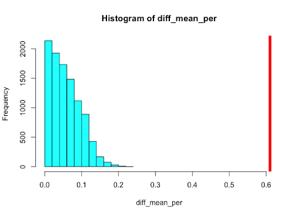

```{r setup, include=FALSE}
source("analysis.R")
source("cleaning.R")
library("dplyr")
library("ggplot2")
library("gridExtra")
```

# Introduction

Getting admitted to graduate school is dependent on a variety of factors. These factors include GPA, statement of purpose, and research experience. Admission is considered depending on these factors. Students who apply to graduate school make their own judgment on how likely they would be successfully admitted based on these factors.

Our overall goal is to better understand what influences a student’s confidence of a successful graduate school application. We investigated how influential each factor in the application was towards the students’ confidence of success. In particular, we want to look for the most important factors that influence students’ confidence of success as well as the least important factors.

An additional question we would like to ask is whether students with research experience tend to have higher GPAs. If there is a notable difference in GPA between students with research experience and those who don’t, it may be an alternative explanation for the potential level of contribution GPA has to students’ confidence.

The data we chose to investigate was from a survey of 500 engineering students who applied to the UCLA Graduate School Program (Mohan, 2019).

# Methods

To help answer the questions we had on our data, we will primarily be using bootstrap and cross-validation in our analysis. Specifically, we will perform Empirical, Residual, and Wild bootstrap on linear regression models and compare the results. To answer the question 'whether students with research experience have a higher GPA,' we will conduct a t-test on both the mean and median of GPA. We expect the mean and median to yield the same results since the distribution of GPA looks normal. However, we do not want to make any assumptions as to whether the distribution is truly normal. Therefore, we will also conduct a permutation test on mean and median. Since the main assumption of a permutation test is exchangeability, with no assumption on the normality of data, we expect the permutation test result to be more robust than that of a t-test.

### Best Subset Selection

Although a linear regression model with all predictors included will likely result in a lower training error than using only “GRE score” as the predictor, we are not sure whether all the predictors being used are associated with the response, students’ chance of admission. If we included some irrelevant variables in our multiple linear regression, we could be adding unnecessary complexity to our model. And this unnecessary complexity could lead to overfitting and thus negatively impact the predictability of our model on independent test sets. Removing these irrelevant variables could also improve the model interpretability, since we would have fewer variables. This helps us better understand the major factors that determine students’ confidence.

There are three major classes of methods to remove irrelevant variables: Subset Selection, Shrinkage Methods, and Dimension Reduction Methods. In our case, we performed a Best Subset Selection, which is a method under the Subset Selection class. The idea of Best Subset Selection is that we fit a separate least squares regression for each and every possible combination of the predictors. And for each number of predictors, we select the model with lowest RSS. Suppose there are a total of $p$ predictors, we would fit $\binom{p}{3}$ models that contain exactly 3 predictors, and so on. In total, we would fit $2^p$ different models.

One of the major disadvantages of using Best Subset Selection is the high computational costs for fitting $2^p$ different models. Also, if $p$, the number of predictors, is large, we might only find predictors that reduce training error while not so much on testing error. This could reduce the predictive power of our model and increase the variance of the coefficient estimates. However, in our data, the number of predictors is 7, which is fairly small relative to the number of observations we have, 500. Therefore, we could use this method without having to worry too much about the computational costs.

### $k$-fold Cross-Validation

And to further analyze models with different numbers of predictors included, we performed a 10-fold cross-validation to see how the models vary in test error. To perform the cross-validation, we used the ‘train’ function in the ‘caret’ library. The function takes in a model, performs cross-validation, and outputs the CV estimate, given by the function ($k$-fold):

$$
CV_{(k)} = \frac{1}{k} \sum_{i=1}^{k}MSE_{i}
$$

Because the CV estimate is dependent on the splitting of the $k$-folds, we would like to see the variance of our CV estimate using different random splitting of the data. Therefore, we perform the cross-validation 10 times using different seeds. Each time, we compute the CV estimate for each of the 7 models we got from the previous Best Subset Selection.

# Results

In our very first simple linear regression model, we used ‘GRE score’ as the predictor and students’ confidence of success as response. If we look at the residual plot, there is not a strong pattern of heteroscedasticity.
```{r residual, echo=FALSE, fig.cap="Residual Plot", out.width='55%', fig.align="center"}

```
Therefore, we could safely perform residual bootstrap on our data. Here is a table showing a comparison of empirical, residual, and wild bootstrap results:

|           | Intercept |          |         | Slope     |          |          |
|-----------|-----------|----------|---------|-----------|----------|----------|
| Bootstrap | Empirical | Residual | Wild    | Empirical | Residual | Wild     |
| Variance  | 0.00927   | 0.0108   | 0.00904 | 9.05e-8   | 1.08e-7  | 8.84e-8  |
| MSE       | 0.00926   | 0.0108   | 0.00904 | 9.05e-8   | 1.08e-7  | 8.83e-8  |
| Lower CI  | -2.64     | -2.65    | -2.64   | 0.00963   | 0.00959  | 0.00964  |
| Upper CI  | -2.33     | -2.31    | -2.33   | 0.0106    | 0.0107   | 0.0106   |

```{r compare, echo=FALSE, fig.cap="Comparison of bootstrap methods", out.width='65%', fig.align="center"}

```
Notice that for both the slope and intercept estimates, the residual bootstrap resulted in a slightly wider confidence interval. While using empirical and wild bootstrap has almost the same resulting confidence interval. However, a narrower confidence interval does not necessarily suggest a better performance of the bootstrap, since our goal is to estimate the true variance. But overall, all three bootstrap results are fairly consistent on our data.

### Multiple Linear Regression Model

After fitting the simple linear regression model, we added in more predictors to build a multiple linear regression model. We used the Best Subset Selection Method described in the Method section of this report. Figure 3 is a chart showing the model selection result.
```{r selection, echo=FALSE, fig.cap="Best Subset Selection result", out.width='95%', fig.align="center"}

```
The asterisk in the chart indicates inclusion of the corresponding predictor in the model. The numbers at the very left represent the number of predictors in the model. As an example, among all the possible models with 2 predictors, 'GRE score' and 'cumulative GPA' have the 'best' performance. Here, 'best' is determined by the cross-validation result in our Method section.

In order to choose the appropriate number of predictors to include in the model, we did a 10-fold cross-validation on each of the models. Using the steps for cross-validation described in our Method section, we plotted the following graph:
```{r cv, echo=FALSE, fig.cap="10-fold CV with different seeds", out.width='55%', fig.align="center"}

```
In this graph, each color corresponds to one random outcome of splitting the data. We did not see a large variance caused by random splitting of data. This might be because the distributions of the variables are normal. Notice that as we go from 1 predictor to 2 predictors, the decrease in cross-validation error is pretty substantial compared to when we go from 5 to 6 predictors. In fact, the change in error from 5 to 6 and 6 to 7 predictors is very small. This suggests that 5 predictors might be sufficient to predict our response variable. The 5 predictors are ‘GRE Score,’ ‘TOEFL Score,’ ‘Letter of Recommendation,’ ‘Cumulative GPA,’ and ‘Research Experience.’

We then fitted a multiple linear regression model using these 5 predictors. Here is a table to help us compare this model with our previous model where only ‘GRE score’ is included.

|              | 1-predictor model | 5-predictor model |
|--------------|-------------------|-------------------|
| adjusted R^2 | 0.778             | 0.819             |
| RMSE         | 0.0659            | 0.0603            |

\newpage

This table displays the coefficient estimates of the predictors:

|             | Estimate  | Std. Error | t value | Pr(>|t|) |
|-------------|-----------|------------|---------|----------|
| (Intercept) | -1.335702 |  0.099075  | -13.48  | < 2e-16  |
| GRE.Score   | 0.001889  |  0.000502  | 3.76    | 0.00019  |
| TOEFL.Score | 0.003017  |  0.000862  | 3.50    | 0.00051  |
| LOR         | 0.019320  |  0.003794  | 5.09    | 5e-07    |
| CGPA        | 0.122980  |  0.009302  | 13.22   | < 2e-16  |
| Research1   | 0.025165  |  0.006599  | 3.81    | 0.00015  |

### t-test, Permutation Test

From the previous regression part, we already know that having a research experience could have an impact of the confidence of success, which meets our expectation. However, we still want to know if there are any correlations among predictors other the response, 'Chance of Admit'. In this part, we choose 'Research Experience' and 'Cumulative GPA.' We expect students who have research experience are more likely to have a higher GPA, we try to test that using a t-test and 2 different permutation tests.

We first conducted a t-test. The null hypothesis is 'there is no difference on GPA between people who have research experience and those who do not.' and the alternative hypothesis is 'there is a difference.' The test statistic we got is $t=13.216$. The t-test shows that there is indeed a difference, the p-value is less than 2.2e-16, which rejects the null hypothesis. And we conclude that the mean of students' GPA who have research experience is higher than those who don't.

We want to know if the permutation test gives the same result. By choosing bootstrap sample size of 10000, we conducted a permutation test. Figure shows the histogram of bootstrap estimates with a vertical line indicating the true difference of mean values.
```{r bt_mean, echo=FALSE, fig.cap="Permutation test on mean", out.width='50%', fig.align="center"}

```
We also performed a permutation test on the median. Figure is the result we obtained.
```{r bt_med, echo=FALSE, fig.cap="Permutation test on median", out.width='50%', fig.align="center"}

```
We got the same result that p-value is really small, so we can reject the null hypothesis and say there is a difference between students' GPA between those who have research experiences and those who do not. Since the distribution of data seems normal, the t-test and the permutation tests yielded the same result.

# Discussion

Based on the regression models and cross validation, five of the factors were considered adequate predictors for a students’ confidence in a successful application. The GPA was considered to be the most significant predictor. The other four were GRE scores, TOEFL scores, letters of recommendation, and research experience.

The t-test and permutation test results agree that students with research experience tend to have a notably higher cumulative GPA than those without research experience. This was true for both the permutation test on the mean and median of students’ GPA. 

# Works Cited
Mohan S Acharya, Asfia Armaan, Aneeta S Antony : A Comparison of Regression Models for Prediction of Graduate Admissions, IEEE International Conference on Computational Intelligence in Data Science 2019


## Some histograms:

```{r hist_plot, fig.width=10, fig.height=6, echo=FALSE}
#grid.arrange(gre_hist, toefl_hist, gpa_hist, rating_hist,
#             sop_hist, lor_hist, res_hist, chance_hist,
#             ncol = 4)
```

## Some box plots:

```{r box_plot, fig.width=15, fig.height=9, echo=FALSE}
#grid.arrange(box_1, box_2, box_3, box_4, box_5, box_6, ncol = 2)
```

